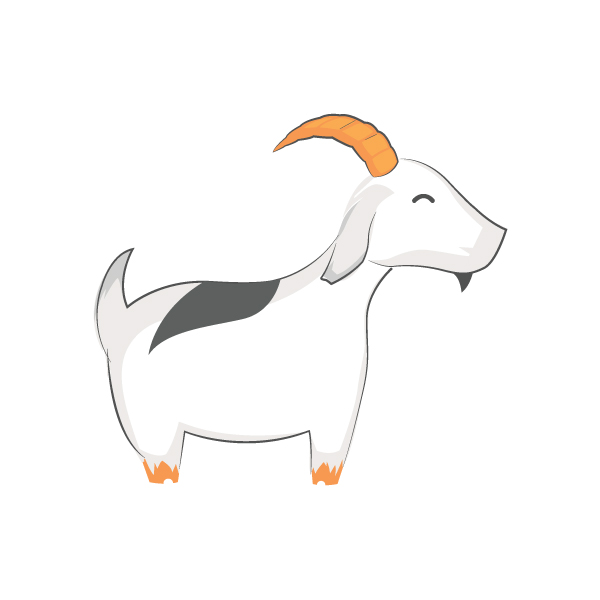

# Rut Database and Rut Querying Language User Guide



## The User Guide is very outdated and has not been updated to reflect many of Rut Database's newer features. It will be rewritten in the near future (hopefully by the middle of 2020).

## Table of Contents

* [Introduction](#introduction-to-rut-querying-language)
* [Work in Progress](#work-in-progress)
* [Data Structure](#data-structure)
* [Compatibility](#compatibility)
* [Connecting to Rut Database](#connecting-to-rut-database)
* [Read Operation](#read-operation)
* [Write Operation](#write-operation)
* [Delete Operation](#delete-operation)
* [Rename Operation](#rename-operation)
* [Exit Operation](#exit-operation)
* [Key Words](#key-words)
* [Comments](#comments)
* [Errors](#errors)
* [Special Thanks](#special-thanks)
* [What does Rut mean?](#what-does-rut-mean)

---
## Introduction to Rut Querying Language


The goal of Rut Querying Language is to be a language that the user loves and enjoys working with. It should be easy to learn, simple in design,  consistent, and at the same time - powerful. While I think SQL is a wonderful language, it seems that alternatives are few and far between. SQL has been around for a very very long time, and I think it’s about time that we tried a new query driven database. Since SQL Databases are the most widely used database servers around (in 2019), I will be using them as a model for comparison.

### I think Rut Querying Language is better than SQL. 
#### Here’s some examples of why:

* In SQL, everything is a flat table. There are no nested fields. There are no composite values  - in fact composite values wouldn’t even pass first normal form. In Rut, none of these cases are a problem, you can have fields nested as deep as you like and organize your data as you please.
* SQL has a group of statements for DDL and another group for DML. Rut has no such distinction, you just read nodes, write to nodes, delete nodes, and rename nodes. 
* SQL has databases, tables, rows, columns. There is no way around that. In Rut, the structure is completely customizable. Like an XML document.
* In a SQL environment, there are often steps that need to be taken to convert the SQL query results into XML or JSON. In Rut you just specify to read 'as XML' or 'as JSon' and the data is converted appropriately.
* Not all SQL implementations support transactions. Rut supports transactions, commit, and rollback. Rut is fully ACID compliant.
* Only some SQL implementations have an easy mechanism for unique id generation. Rut offers a system wide unique id generation mechanism, perfect for creating unique record ids.
* In SQL, record ids are not always visible to the user. In Rut, the record id is always accessible by the user.
* In SQL, indexes can be a complicated process. In my opinion, it can become a massive annoyance. I feel that modern databases should be at a high enough level that worrying about the inner workings of the database's memory addressing and messing with fine tuning indexes for querying speed should not really be a concern of the developer. To compare this with using traditional programming languages I would say using Rut would be like Java or Python while SQL is more like C. Indexes in Rut are used for what they're made for - locating data quickly and in a way that the developer does not need to know or care about. Indexes should be able fetch data quickly without the need to really fine tune anything. In Rut, indexes are made easy! Every node has a built in index - the name of the node. Multiple nodes that share a name are indexed together as a group. Every single piece of data in Rut can be accessed directly by name.
* SQL has joins - and Rut has joins too! Rut looks at a group of nodes the same way that SQL databases look at a set of selected columns. Therefore, inner join and outer joins are entirely feasible. Rut does relational joins while still maintaining the ability for nested and composite fields of data, something SQL cannot do.
* SQL language can seem clunky, unwieldy, and has extra keywords and commands that are not necessary. Rut on the other hand has a pleasant syntax and allows flexibility in data selection and traversal with only a tiny selection of very readable operations and keywords.
* Most SQL implementations force you to define the data types for your columns before using the table. In Rut, node values are loosely typed unless data types and other rules are explicitly applied to them. Feel free to store whatever you want in a field, heck, in Rut you can create and populate the field in one command - without ever having to specify a data type.
* Due to the fact that at the end of the day, Rut Database is hierarchical, it can accommodate data models that SQL could not even dream of being able to touch.

With all of the advantages I feel that Rut has over SQL, I still want to note that I truly love using SQL databases and that is where most of my inspiration has come from. I love using Rut more though and I hope that someone out there also enjoys using this language and the magnificent database that Rut Querying Language powers.

The design principles for Rut are simplicity and consistency. 
1) There must be very few operations. Extra verbs should not be necessary when one or two more generic verbs can suffice for several similar actions. 

2) All of the operations should have the same argument structure. For example, every way of specifying a node to select in the ‘read’ operation can also be used to specify a node to write to in the ‘write’ operation and a node to delete in the ‘delete’ operation.

3) Rut should read like English, there should be no bizzare special characters outside of a regular expression. When using non-character symbols, their significance is either in a way that matches the symbol or in a way that is traditional for basically all programming languages,
For instance to select a node’s children you use the colon like so: 
node: child 1, child 2, child 3.  Traditional special characters include a semicolon to end a statement and the parentheses to note a subquery.

This user guide is divided into sections, several of them pertain to a particular Rut Database operation. The instructions for each operation are laid out in detail, but it should be emphasized that the arguments across the various operations in Rut Querying Language are very consistent. Arguments that work with 'read' will work with 'write', 'delete', and 'rename' when used in the same context unless the usage of the argument doesn't make sense.

---
## Work in Progress


I began working on Rut at the begining of September 2019. I plan on releasing the first production ready version by June 1, 2020. I am the only developer, but I work on this project daily (squeezing it in between my working schedule). As I make changes, they are uploaded to this repository. Additional features and updates will be reflected in this user guide as progress is made. Feel free to contribute or offer suggestions! This project will always be open source and will always be sponsored at my personal expense.

---
## Data Structure


The best way to describe Rut Database is a structure similar in concept to XML, but also a structure that supports relational joins, subqueries, and aggregate functions like in SQL. 
A Rut Database is a non-binary heirarchical tree. Every piece of data in Rut is called a node. A node must have a name and a node may have a value. A node may also have children. Nodes can be divided into two categories, leaf nodes and branch nodes. 

Branch nodes have children and leaf nodes do not. Generally branch nodes will not have values, but that is not always the case. The developer is free to design their Rut database however they choose.

There is one major difference between Rut and XML, which is a design choice. In Rut, two children nodes of the same parent cannot have the same name. However, two nodes with different parents can absolutely have the same name.

Here is an example of a Rut database structure created similarly to an example traditional SQL database: 

```console
===============
database1->
    company->
        6->
            companyCity-> Annapolis
            companyState-> Maryland
            companyName-> Morris Baker
            companyMotto-> Success through political manipulation and widespread abuse of public trust
        5->
            companyName-> Tritech
            companyState-> Maryland
            companyCity-> Baltimore
            companyMotto-> Success through winning
    employee->
        0->
            employeeFirstName-> William
            employeeLastName-> Jackson
            employeeCompany-> Tritech
            employeeTitle-> Programmer
        1->
            employeeFirstName-> Jack
            employeeLastName-> Heathford
            employeeCompany-> Tritech
            employeeTitle-> Programmer
        2->
            employeeFirstName-> Mary
            employeeLastName-> Robinson
            employeeCompany-> Tritech
            employeeTitle-> Tester
        3->
            employeeFirstName-> Sheila
            employeeLastName-> Carlton
            employeeCompany-> Tritech
            employeeTitle-> Project Manager
        4->
            employeeFirstName-> Isaac
            employeeLastName-> Katz
            employeeCompany-> Morris Baker
            employeeTitle-> Project Manager
        7->
            employeeFirstName-> Marcy
            employeeLastName-> Gray
            employeeCompany-> Morris Baker
            employeeTitle-> Lead Developer
        8->
            employeeFirstName-> Marshall
            employeeLastName-> Tucker
            employeeCompany-> Morris Baker
            employeeTitle-> Programmer Analyst
        9->
            employeeFirstName-> Samuel
            employeeLastName-> Jenkins
            employeeCompany-> Morris Baker
            employeeTitle-> Programmer Analyst
        10->
            employeeFirstName-> Hua Ling
            employeeLastName-> Yu
            employeeCompany-> Morris Baker
            employeeTitle-> Tester
        11->
            employeeFirstName-> Bill
            employeeLastName-> Dobbins
            employeeCompany-> Morris Baker
            employeeTitle-> Business Analyst
            
===============
```

Notice there is database called database1, next there are two ‘tables’: employee and company. Each of these tables has records that contain fields, or in SQL they would be called ‘columns’. However, unlike in SQL, every record in Rut has a name - it is required in Rut for every Node to have a name. 

This name does not have to be unique - for instance, there are ten nodes named 'employeeFirstName'. However, since the name given is a reference to the field (or list of fields when the name is not unique) it may be beneficial to give certain types fields a unique name so they can be referenced later on with ease. If it gets annoying to have to come up with unique ids for your nodes, you can use the key word ‘newid’ - it will automatically generate a system wide unique identifier for a particular node.

Here’s a different Rut Database example structure:

```console
===============
database2->
    backpack->
        982->
            who-> Coolware
            specs->
                model-> Tragedy 5
                width-> 10
                height-> 4
        182->
            who-> Abbit
            specs->
                model-> Tragedy 5
                width-> 10
                height-> 4
                
===============
```

Notice the nested fields in ‘backpack’ called ‘specs’. Nested fields, composite fields, all sorts of structures are allowed in Rut that are not allowed in SQL. Feel free to experiment and have fun! 


---
## Compatibility


Rut Database is written in Java and can therefore run on the major platforms (i.e. Windows, Linux, Max OS X, etc.)
I am building libraries to integrate Rut Database with all of the mainstream languages as quickly as I can. I hope to have libraries built for every widely used platform in the future. Feel free to help me out with that if you want it to go faster...

## Connecting to Rut Database


There are three ways to connect to Rut Database. By interactive shell, command line argument, or script file.

1) **Interactive Shell:** This is the most common way to use Rut Database. The shell can be used in the terminal or by an application in the same way a SQL Database would be used. To connect to the Rut Database development application, compile the source files and export the binary as a runnable jar file called 'rut.jar'. If you need some help doing this, download Eclipse and then Google how this is done with Eclipse (it is a very simple procedure). Once you have created the binary, run:

```console
java -jar rut.jar
```

2) **Command Line Argument:** You can pass commands as arguments to the Rut shell executable, you don't have to end your statements with an 'exit;'.

3) **Script File:** Rut scripts are files that end with '.rut'. To run a Rut script, include the name of your script file as the command line argument. For instance to run resources\test_script.rut on a Windows platform, run : 
```console
java -jar rut.jar resources\test_script.rut
```

---
## Read Operation


The read operation retrieves nodes from the database for the user or application.

##### Selected Node Name
 
**read < node name / node names >;**

Example 1:

```console
read 0;
===============
0->
    employeeFirstName-> William
    employeeLastName-> Jackson
    employeeCompany-> Tritech
    employeeTitle-> Programmer
    
===============
```

Example 2:

```console
read employeeFirstName;
===============
employeeFirstName-> William

employeeFirstName-> Jack

employeeFirstName-> Mary

employeeFirstName-> Sheila

employeeFirstName-> Isaac

employeeFirstName-> Marcy

employeeFirstName-> Marshall

employeeFirstName-> Samuel

employeeFirstName-> Hua Ling

employeeFirstName-> Bill

===============
```

Example 3:

```console
read database;
===============
database->
    company->
        6->
            companyCity-> Annapolis
            companyState-> Maryland
            companyName-> Morris Baker
            companyMotto-> Success through political manipulation and widespread abuse of public trust
        5->
            companyName-> Tritech
            companyState-> Maryland
            companyCity-> Baltimore
            companyMotto-> Success through winning
    employee->
        0->
            employeeFirstName-> William
            employeeLastName-> Jackson
            employeeCompany-> Tritech
            employeeTitle-> Programmer
        1->
            employeeFirstName-> Jack
            employeeLastName-> Heathford
            employeeCompany-> Tritech
            employeeTitle-> Programmer
        2->
            employeeFirstName-> Mary
            employeeLastName-> Robinson
            employeeCompany-> Tritech
            employeeTitle-> Tester
        3->
            employeeFirstName-> Sheila
            employeeLastName-> Carlton
            employeeCompany-> Tritech
            employeeTitle-> Project Manager
        4->
            employeeFirstName-> Isaac
            employeeLastName-> Katz
            employeeCompany-> Morris Baker
            employeeTitle-> Project Manager
        7->
            employeeFirstName-> Marcy
            employeeLastName-> Gray
            employeeCompany-> Morris Baker
            employeeTitle-> Lead Developer
        8->
            employeeFirstName-> Marshall
            employeeLastName-> Tucker
            employeeCompany-> Morris Baker
            employeeTitle-> Programmer Analyst
        9->
            employeeFirstName-> Samuel
            employeeLastName-> Jenkins
            employeeCompany-> Morris Baker
            employeeTitle-> Programmer Analyst
        10->
            employeeFirstName-> Hua Ling
            employeeLastName-> Yu
            employeeCompany-> Morris Baker
            employeeTitle-> Tester
        11->
            employeeFirstName-> Bill
            employeeLastName-> Dobbins
            employeeCompany-> Morris Baker
            employeeTitle-> Business Analyst
            hat-> purple
    guinea_pig->
        12->
            name-> Cutsie Wutsie
            weight-> 5
        13->
            name-> Squeaky
            weight-> 4
    backpack->
        982->
            who-> Coolware
            specs->
                model-> Tragedy 5
                width-> 10
                height-> 4
        182->
            who-> Abbit
            specs->
                model-> Tragedy 5
                width-> 10
                height-> 4
                
===============
```

Example 4:

```console
read company;
===============
company->
    6->
        companyCity-> Annapolis
        companyState-> Maryland
        companyName-> Morris Baker
        companyMotto-> Success through political manipulation and widespread abuse of public trust
    5->
        companyName-> Tritech
        companyState-> Maryland
        companyCity-> Baltimore
        companyMotto-> Success through winning
        
===============
```

##### Selected Parent Names
  **read  < parent name structure, for each parent in the path, a period must seperate the names. >.< node name / node names >;**
 
Example 1:

```console
read database.employee.1;
===============
database->
    employee->
        1->
            employeeFirstName-> Jack
            employeeLastName-> Heathford
            employeeCompany-> Tritech
            employeeTitle-> Programmer
            
===============
```

Example 2:

```console
read database.employee.10.employeeTitle;
===============
database->
    employee->
        10->
            employeeTitle-> Tester
            
===============
```

Example 3:
 
```console
read 10.employeeTitle;
===============
10->
    employeeTitle-> Tester
    
===============
```

Example 4:

```console
read database.backpack;
===============
database->
    backpack->
        982->
            who-> Coolware
            specs->
                model-> Tragedy 5
                width-> 10
                height-> 4
        182->
            who-> Abbit
            specs->
                model-> Tragedy 5
                width-> 10
                height-> 4
                
===============              
```

Example 5:

```console
rut~> read specs.width;
===============
specs->
    width-> 10
    
specs->
    width-> 10
    
===============
```

##### Selected Children Names
  
  **read < optional parent name structure, for each parent in the path, a period must seperate the names. >< node name / node names >: < children nodes or grandchildren nodes to read - each node name separated by a comma >;**
 
 For selected children names, the engine traversed the selected node until it either finds the nodes that have the provided children names or the nodes are not found. For any traversal level that they are found on, other nodes are filtered out. If the nodes listed in selected node children are not on a particular traversal level, they have no influence on the results displayed.
 For instance, **'read company: companyName;'** will read the company name and no other children from the 2 nodes named 6 and 7 that are children of company. If there were more nested levels between company and companyName, the results would still be displayed in the same way. The nodes along the way (for instance nodes 6 and 7) are not filtered at all, even though their names are not 'companyName' because they do not have siblings that meet the selected children name criteria (i.e. named companyName).
 **tl;dr** for read, selected children names work for grand children, great grand children and deeper descendants. This is not the case with write, write will write only to the node's children when selected children names are provided in a statement.
 
Example 1 (children):

```console
read 6:companyName, companyMotto;
===============
6->
    companyName-> Morris Baker
    companyMotto-> Success through political manipulation and widespread abuse of public trust
    
===============
```

Example 2 (grandchildren):
 
```console
read company: companyName, companyMotto;
===============
company->
    6->
        companyName-> Morris Baker
        companyMotto-> Success through political manipulation and widespread abuse of public trust
    5->
        companyName-> Tritech
        companyMotto-> Success through winning
        
===============
```

Example 3 (more grandchildren):

```console
read employee: employeeFirstName, employeeLastName;
===============
employee->
    0->
        employeeFirstName-> William
        employeeLastName-> Jackson
    1->
        employeeFirstName-> Jack
        employeeLastName-> Heathford
    2->
        employeeFirstName-> Mary
        employeeLastName-> Robinson
    3->
        employeeFirstName-> Sheila
        employeeLastName-> Carlton
    4->
        employeeFirstName-> Isaac
        employeeLastName-> Katz
    7->
        employeeFirstName-> Marcy
        employeeLastName-> Gray
    8->
        employeeFirstName-> Marshall
        employeeLastName-> Tucker
    9->
        employeeFirstName-> Samuel
        employeeLastName-> Jenkins
    10->
        employeeFirstName-> Hua Ling
        employeeLastName-> Yu
    11->
        employeeFirstName-> Bill
        employeeLastName-> Dobbins
        
===============
```


### Where Condition
**read < argument > where < nodeName > = < value >;**
 
Only record sets with the specified node  set to the specified value will be read.
 
 OR
 
**read < argument > where < nodeName >;**

Only record sets containing the specified node will be read.
    
This feature is currently being worked on!
Where conditions can be joined with ‘and’s and ‘or’s. At the moment there is only a ‘,’ and it functions as an or. This will be changed soon and the examples will be updated!
 
Example 1:

```console
read employee:employeeFirstName, employeeLastName, employeeTitle where employeeCompany = Tritech;
===============
employee->
    0->
        employeeFirstName-> William
        employeeLastName-> Jackson
        employeeTitle-> Programmer
    1->
        employeeFirstName-> Jack
        employeeLastName-> Heathford
        employeeTitle-> Programmer
    2->
        employeeFirstName-> Mary
        employeeLastName-> Robinson
        employeeTitle-> Tester
    3->
        employeeFirstName-> Sheila
        employeeLastName-> Carlton
        employeeTitle-> Project Manager
        
===============
```

Example 2:

```console
read employee:employeeFirstName, employeeLastName, employeeTitle where employeeCompany = Morris Baker;
===============
employee->
    4->
        employeeFirstName-> Isaac
        employeeLastName-> Katz
        employeeTitle-> Project Manager
    7->
        employeeFirstName-> Marcy
        employeeLastName-> Gray
        employeeTitle-> Lead Developer
    8->
        employeeFirstName-> Marshall
        employeeLastName-> Tucker
        employeeTitle-> Programmer Analyst
    9->
        employeeFirstName-> Samuel
        employeeLastName-> Jenkins
        employeeTitle-> Programmer Analyst
    10->
        employeeFirstName-> Hua Ling
        employeeLastName-> Yu
        employeeTitle-> Tester
    11->
        employeeFirstName-> Bill
        employeeLastName-> Dobbins
        employeeTitle-> Business Analyst
        
===============
```

Example 3:

```console
read employee where employeeTitle = Programmer Analyst;
===============
employee->
    8->
        employeeFirstName-> Marshall
        employeeLastName-> Tucker
        employeeCompany-> Morris Baker
        employeeTitle-> Programmer Analyst
    9->
        employeeFirstName-> Samuel
        employeeLastName-> Jenkins
        employeeCompany-> Morris Baker
        employeeTitle-> Programmer Analyst
        
===============
```

Example 4:

```console
read company where companyName = Morris Baker;
===============
company->
    6->
        companyCity-> Annapolis
        companyState-> Maryland
        companyName-> Morris Baker
        companyMotto-> Success through political manipulation and widespread abuse of public trust
        
===============
```

Example 5 (Where condition for the present of a node in the result set):

```console
read employee where hat;
===============
employee->
    11->
        employeeFirstName-> Sneaky Pete
        employeeLastName-> Dobbins
        employeeCompany-> Morris Baker
        employeeTitle-> Business Analyst
        hat-> purple
        
===============  
```

##### Inner Joins - COMING SOON...with output display

Example 1 (inner join two nodes):

```console
read employee joins company;
```


Example 2 (Read specific nodes from company and specific nodes from employee when they are inner joined):

```console
read employee joins comapny:company.companyName, company.companyMotto, employee.employeeFirstName, employee.employeeLastName;
```

##### Outer Joins - COMING SOON

##### Aggregate Functions - COMING SOON

##### As XML - COMING SOON

##### As JSon - COMING SOON

##### To < file name > - COMING SOON

You can specify 'to < file name >' and the results of read will be copied to the specified file, if accessible by the database. This works great in scripts and in combination with 'as xml' or 'as json'.

Example 1 (XML):

```console
read database as xml to output.txt;
```

Examle 2 (JSon):

```console
read employee as json to output.json
```

---
## Write Operation


The write operation creates and/or writes to one or more nodes in the database.

##### Selected Node Name
 
**write < node name / node names > < optionally = a value >;**

Example 1 (Create or reset the value for an employee with the id 0):

```console
write 0;
```

Example 2 (Change all employee last names in the system to Smith - this will change 10 nodes!):
```console
write employeeLastName = Smith;
```

##### Selected Parent Names
**write  < parent name structure, for each parent in the path, a period must seperate the names. >. < node name / node names > < optionally = a value >;**

Example 1 (give employee 0 a first name!):

```console
write 0.employeeFirstName = Mark;
```

Example 3 (create a new company, use the newid keyword - which generates a system wide unique id for this new company’s record id):

```console
write company.newid;
```

##### Selected Children Names
  
**write  < optional parent name structure, for each parent in the path, a period must seperate the names. >.< node name / node names >: < children nodes or grand children nodes to write to - each node name separated by a comma. Optionally each one may have an = sign followed by a value >;**

Selected children names in write allow you to write to a node and its children in a single statement. Ideal for populating new records.
 
Example 1 (create new employee with the newid keyword and assign him values):

```console
write employee.newid: employeeFirsName = Bishop, employeeLastName = Kensington, employeeCompany = Morris Baker, employeeTitle = Senior Developer;
```

Example 2 (create a new company, but leave some of the fields blank)
```console
write company.newid: companyCity, companyState, companyMotto, companyName = Orange;
```

Example 3 (populate the new company we created - it's id is 14):

```console
write 14: companyCity = Mobile, companyState = Alabama, companyMotto = The Best is not good enough;
```

Example 4 (write to all of the child nodes of someNode a new node called a, for each of these a nodes, create and populate the children b and c):

```console
write someNode.child.a = 1: b = 2, c = 3;
```

##### Where Condition

**write < argument > where < nodeName > = < value >;**

Only record sets with the specified node  set to the specified value will be written to.
 
 Or
 
**write < argument > where < nodeName >;**

Only record sets containing the specified node will be written to.

This feature is currently being worked on!
Where conditions can be joined with ‘and’s and ‘or’s. At the moment there is only a ‘,’ and it functions as an or. This will be changed soon and the examples will be updated!
 
Example  1 (where condition with a value):

```console
write companyMotto = Winning where companyName = Orange;
```

Example 2 (Where condition testing the presence of a node in the result set):

```console
 write employeeFirstName = Sneaky Pete where hat;
```

## Delete Operation


The delete operation deletes one or more nodes from the database.
 
**delete < node name / node names >;**

Or

**delete < parent name structure >.< node name / node names >;**

Example 1 (delete employee id 0):

```console
delete 0;
```

Example 2 (delete all of the employees, including the employees node):

```console
delete employee;
```

Example 3 (delete the width column from specs in each backpacks node):

```console
delete specs.width;
```
##### Where Condition

Will complete and make fully functional.

**(COMING SOON)**
Example  (delete employees that work for Tritech):
```console
delete employee where employeeCompany = Tritech;
```

## Rename Operation


The rename operation renames one or more nodes in the database. You cannot rename a node a name that would cause the parent node to have duplicate child names. Therefore, while the 'child' key word works for rename, it will not work as a substitute for the node to rename because that would cause multiple children of a single node to have the same name. 
 
**rename < node name / node names > = < new name >;**

Or
**rename < optional parent name structure, for each parent in the path, a period must seperate the names.  >.< node name / node names > = < new name >;**


Example 1 (rename the node(s) with name 0 to 1):
```console
rename 0 = 1;
```
##### Where Condition

I doubt I will implement this for rename because it just doesn’t seem useful..


---
## Exit Operation


Exits the interactive shell.

```console
exit;
Goodbye.
```

---
## Key Words


### newid

Generates a system wide unique identifier - great for creating unique record ids as node names.

### child

A key word that substitutes for all of a particular node's children. Can be used for processing all of the nodes that are children of a node simultaneously.
Examples:

```console
write employee.child.employeeFirstName = Jack;

write employee.child.newEmployeeField; 

read shirt.child.size;
```

Check out the power!


```console
 write a.child = lava;
6 nodes written to.
 read a;
===============
a-> 
    b-> lava
    c-> lava
    d-> lava

a-> 
    b-> lava
    c-> lava
    d-> lava

===============
```

**Note:** The child key word cannot be used repeatedly in a statement. The child keyword must be proceeded by at least one parent name. The child key word can only be used to perform operations, it cannot be used in a where condition filter - it wouldn't make any sense because child is a placeholder for multiple node names, not a single node name that a where condition would apply to.

### root

References the very first node of the database (the root). This is included simply as a matter of convenience - you do not ever need to use the 'root' key word in a statement when reading the entire database, just give root's children unique names and call on those nodes instead (e.g. database, database1).

---
## Comments


Statements that are comments start with '//'. These lines are not processed by the interpreter. Comment lines should end with a ';' to denote that it is the end of the comment.

```console
//I am a comment.;
```

---
## Errors


The errors in Rut fall under two categories. General input errors and operation specific errors. Operation specific errors are errors that concern a specific operation rather than general improper inputs. In an interactive shell or TCP/IP connection, all errors are returned after each incorrect statement. For .rut scripts, errors are displayed after the execution of the script and the line number containing the error is reported.

---
## Transactions


**(COMING SOON)!!**
Transactions start by using the **'begin'** keyword. If you are satisfied with the changes, you can **'commit'** and you can also **'rollback'**. Once a transaction begins, any nodes that are written to  will be locked exclusively to the shell id that is writing to them. Until a **'rollback'** or **'commit'** is issued, no other shell will be able to write to these nodes. If the shell that began the transaction quits without commiting, the transaction will then automatically rollback.

---
## Special Thanks


To all of my coworkers and other friends who helped me with suggestions, feedback, and taking the time to check out my project!

To my wonderful herd who readily accepted me as a member, Team Ornary - Shoshi the naturally pulled but still mighty brown colored leader, followed by her buck protector Buddy, with his long powerful horns and silly disposition, and the herd is completed by Mimi the cute little black colored wonderful bundle of love with little horns that sometimes thinks she's the herd boss and immediately tries to hump pretty much any human being when they bend over! Since she is on the bottom of the pecking order, she was not allowed to sleep on the higher levels with Shoshi and Mimi but her favorite place to sleep was on the bottom shelf in my room.
I miss you guys dearly, but you will be happier on a farm with a loving family, I just didn't have a multi-acre farm to give you, and I am sorry. This project is for you. ( My herd is now living as pets on a farm with other goats to mingle with, yet the three of them still stick together and have their little own clique. Shoshi is still the boss and the other two just follow her around all day. )

---
## What does Rut mean?


Rut is the time that the male goat is receptive to mating corresponding with when the females are in heat. During this period, the male is so focused on thinking about does, that he will lose 20% - 30% of his body weight. He does things during this period that range from the absolutely hilarious to the utterly disgusting. 

First of all, the male goat will cover himself head to toe in his own urine, rubbing it real good into his face like war paint. The reason he does this is that no doe will even consider mating with a goat that doesn't smell like a skunk. 

Second of all, the male goat has to check out if every female is in heat, right? He smells their behind but this does not really tell him whether or not they are in season, he just does this because male goats love this smell. In order to find out whether or not she's in heat, he has to smell her urine stream. So every time a female goat goes to take a piss, you see this male goat come running at top speed to smell the urine mid-stream. He then makes this funny face called the flehmen response after smelling the urine. This makes him look like the biggest pervert ever. At this time, he will know if the doe is in heat or not. He will either walk away wagging his tail excitedly and planning his next move or he will walk away sad with his tail between his legs.

Next, he physically competes with every male in sight for domination, and subsequently, breeding rights. He does this by beating the living hell out of the other male goats with his forehead, which is a solid, slightly raised, hard bashing instrument. If he has horns, these will be used as both a shield, a blunt weapon, and in extreme cases, a piercing weapon. A male goat is fully capable of turning his head backwards and stabbing with his horns, if they are pointed straight. My goat Buddy had horns like these, and enjoyed practicing his horn skills by stabbing cardboard boxes, which I provided. But he was too sweet to actually hurt a fly, he was so kind to his herd mates. He once walked up to my guinea pigs, sniffed them curiously, and walked away.
